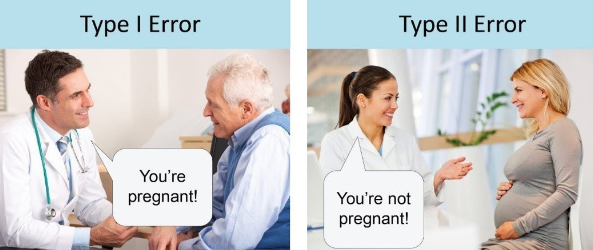

# Statistical Thinking and Quantitative Analysis

# Plan for This Week

- Quantitative analysis and statistics
- Null hypothesis testing
- Matching statistical tests with research designs

# Goals of Quantitative HHS Research

Most quantitative HHS research seeks to:

- Describe populations and samples - descriptive purpose
- Compare groups - understand differences, evaluate programs/interventions
- Examine relationships among variables - how variables associate
- Evaluate models with multiple predictors - what factors are most important in predicting outcomes

Researchers typically draw conclusions using statistical tests that assess:

- Group differences
- Correlations
- Statistical significance

# What Is Statistical Significance?

Statistical significance addresses a simple question:

> Is the observed effect large enough that it is unlikely to be zero in the population?

Examples:

- Are males and females different in IQ?
- Is father involvement related to girls' self-esteem?
- Is the observed correlation different from zero? Is the difference so big, it is unlikely to be zero

# Null Hypothesis Testing

The null hypothesis states that no effect exists

Examples:

- No difference between groups
- Correlation equals zero
- Treatment effect equals zero

Statistical testing attempts to determine whether there is sufficient evidence to reject the null hypothesis. So in your thesis/dissertation, you are *hoping* for **p** \<.05 so you can "reject the null"

# Type I Error

A Type I error occurs when:

- We reject the null hypothesis when null hypothesis is actually true

This is a false positive. We claim based on the data we collected from a sample, that an effect exists -High intensity interval training improves cardiovascular performance better than... -Spanking/phyiscal punishment is associated with increased aggressive behaviors in children... -Smoking is related to stress... ***But in the population those effects/differences don't exist/aren't true***

The probability of committing a Type I error is determined by α (alpha), typically:

- .05
- .01
- .001

# Type II Error

A Type II error occurs when:

- We fail to reject the null hypothesis when a real effect actually exists -Researcher concludes that UNCG women soccer players not more likely to experience ACL tears compared to male soccer players -but in reality that is true in the population... -Children in classrooms with smaller teacher-to-student ratio do not have higher reading scores... -Frequency of smoking is not associated with lung cancer...

Common causes include:

- Small sample sizes
- **Low statistical power**

{fig-alt="A Dr. Pointing to a man's stomach and saying \"you are pregnant\" representing TYPE I error, a female Dr. pointing to an obviously pregnant woman's belly and saying \"you are not pregnant\" to represent TYPE II error"}

# Problems with NHST

Critics argue that:

- Virtually all null hypotheses are false **illogical anyway**
- p-values are often misinterpreted; not **95 chance the hypothesis is true**
- Statistical significance says little about *practical importance*
- Lower p-values do not imply stronger effects

Researchers increasingly advocate reporting:

- Effect sizes
- Confidence intervals
- Bayesian analyses

# Statistical versus Practical Significance

A statistically significant effect may be trivial in practice

Large samples can make tiny effects statistically significant -Do I want to encourage schools to target suicide prevention to Southeast Asian students based on 8.5% self-reported suicidal thoughts were 8.9%?

Therefore researchers should report:

- Effect sizes
- Confidence intervals
- Practical implications

# Quick Review of some other terms/ideas/stats

# Confidence Intervals

Confidence intervals estimate a plausible range of values for a population parameter

Example:

A 95% confidence interval that excludes zero typically indicates statistical significance

# Standardized (Z) Scores

Z scores place observations on a common scale

Formula:

$$z=\frac{X-\bar X}{SD}$$

Interpretation:

- Positive z = above the mean
- Negative z = below the mean

Example:

A score of 78 may be above average in one class but below average in another

Z scores place both scores in context

# Choosing an Analysis

Questions to consider:

1.  What is the research question?
2.  What is the hypothesis?
3.  What is the research design?
4.  How many variables are involved?
5.  What levels of measurement are present?

# Group Comparison Tests

**Independent Samples t Test**

-Used to compare means (so continuous variables) across two groups

-Examples:

- Men versus women: Do women report greater parental anxiety than men?
- Treatment versus control: Do participants in a smoking cessation program...

**ANOVA**

-Used to compare means across three or more groups

**ANCOVA**

-ANOVA including covariates, or control variables

**MANOVA**

Multiple dependent variables

# Tests of Association

**Pearson Correlation**

Used with two continuous variables

Examples:

- Age and self-esteem
- Education and income

Other Correlations

- Kendall's Tau
- Polychoric
- Polyserial
- Point-biserial
- Phi

# Multiple Regression

Multiple regression predicts one outcome from multiple predictors

General model:

$$Y = a + b_1X_1 + b_2X_2 + e$$

Researchers use regression to:

- Explain phenomena
- Control for confounding variables
- Estimate unique effects of predictors

# Logistic Regression

Used when the outcome variable is dichotomous

Examples:

- Pregnant/not pregnant
- Used drugs/did not use drugs
- Died/survived

Results typically include:

- Regression coefficients
- Odds ratios

# Correlation versus Regression

Correlation addresses association

Regression allows:

- Multiple predictors
- Statistical control
- Prediction

Example:

Divorce may predict adolescent depression, but that relation may weaken after controlling for inter-parental conflict

# Statistical Power and Effect Size

Power analysis helps determine sample size requirements

General rule:

- Large effects require smaller samples
- Small effects require larger samples

Power analysis is especially important in grant writing

# Quick Note

There really is not a difference between ANOVAs and Regressions! 

-There were historical reasons why ANOVA came to be associated with experimental and agricultural research 
-Researchers used to think that if one was doing experiments, they should do an ANOVA -If they were doing observational/correlational research, should use regressions
-I was taught that in grad school at first, then in class taught that these were all the **general linear model**

# The General Linear Model

This applies to any analysis that has a continuous (interval or ratio) or "quantitative" outcome

-T-tests and ANOVAs are just a "special" case
  - that is, they are regressions with a categorical predictor or IV or X
  - if you run a t-test comparing self-esteem across boys/girls and then run a regression where you regress self-esteem on gender (dummy coded) you will get the same result!
  - Note I worked on a multisite project where the statistician at the other institution was running "ANCOVAs" to evaluate the intervention effect
  -That made sense because he was considering how 6-month post-test anxiety (for example) differed by group (experimental vs control), controlling for baseline scores
  -I did the same exact analysis but called it a multiple regression, I regressed 6 month anxiety on an effects coded binary X or IV variable and controlled for baseline anxiety
  -We would come to the same conclusion in this case...
  
The point of all of this is to say...

* ANOVAs and Regressions are basically the same
-Really the more accurate way to say that is that ANOVAs are a *special case* of regressions